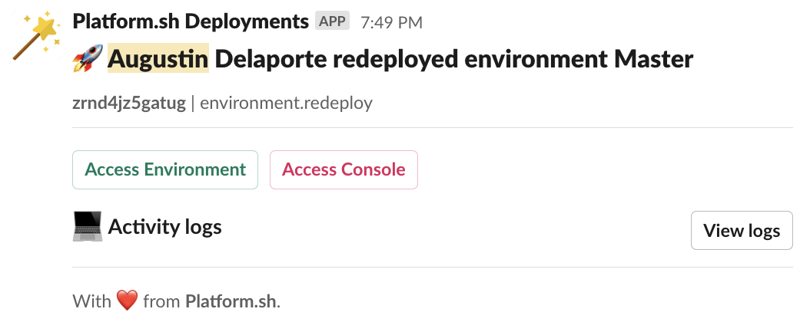

# Activity Scripts for Platform.sh

Activity Scripts enhance Platform.sh capabilities to customize third-party integrations.

## Install

Please refer to the [Platform.sh documentation](https://docs.platform.sh/integrations/activity.html).

## Scripts

### slack/slack-deployment-notification.js

This script alerts on your Slack channel about new deployments on your project, and provides useful links to easily access information about the deployment.

Once you have configured Slack to receive webhooks, you need to create the `SLACK_URL` variable on your Platform.sh project:

```
https://hooks.slack.com/services/XXXXX/XXXXXX/XXXXX
```

Then you can install the script

```json
curl https://raw.githubusercontent.com/GuGuss/platformsh-activity-scripts/main/slack/slack-deployment-notification.js --output script.js
platform integration:add --type script --file ./script.js --events environment.redeploy,environment.push --states="complete"
rm script.js
```



## LICENCE

[MIT](LICENSE)